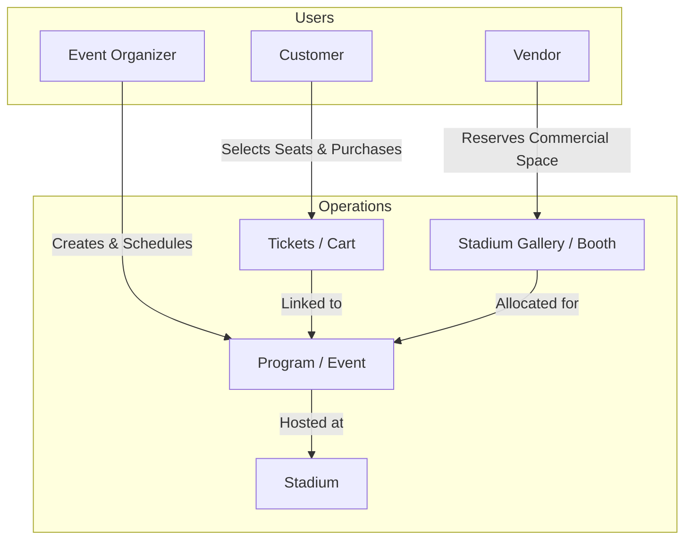

# Stadium Ticket Management System

A multi-role web platform built with **Spring Boot** and **Thymeleaf** for managing stadium events, interactive ticket bookings, and vendor space reservations.

[](https://stadium-ticket-management-system-production.up.railway.app/)
[](https://openjdk.org/)
[](https://spring.io/projects/spring-boot)
[](https://www.mysql.com/)
[](LICENSE)

---

## 🌐 Live Application

- **Live URL:** [https://stadium-ticket-management-system-production.up.railway.app/](https://stadium-ticket-management-system-production.up.railway.app/)
- **Quick Test Accounts (Pre-seeded):**
  - **Event Organizer:** `rifat@gmail.com` / `abcde`
  - **Customer / Vendor:** Self-registration is active directly on the platform.

---

## 📌 Project Overview

Managing stadium logistics requires coordinating match schedules, public ticket sales, and commercial stall allocations. This application provides a unified portal for three distinct user roles:

1. **Customers:** Browse upcoming sports matches and concerts, pick seats in real-time, manage their booking cart, complete checkout, and review order history.
2. **Event Organizers:** Schedule events, assign them to partner stadiums, specify dates/durations, and track published listings.
3. **Vendors:** Browse stadium galleries/booths and book commercial exhibition slots for scheduled event days.

---

## 🛠️ Tech Stack

| Layer | Technologies |
|---|---|
| **Backend** | Java 17, Spring Boot 3.1.5, Spring MVC, Spring Data JPA, Hibernate |
| **Frontend** | Thymeleaf, HTML5, CSS3, Vanilla JavaScript |
| **Database** | MySQL 8.0, HikariCP Connection Pooling |
| **Build & Tooling** | Maven (wrapper included), Git |
| **Deployment** | Railway (Cloud Container + Managed MySQL) |

---

## 🏗️ Architecture & Domain Flow



### Key Data Entities
- **Customer:** Manages profile, tickets, cart items, and event feedback.
- **EventOrganizer:** Organizes programs linked to specific stadiums.
- **Vendor:** Books physical gallery booths inside stadiums during events.
- **Stadium & Gallery:** Stores venue capacities, geographical locations, and booth configurations.
- **Program & Ticket:** Manages event timelines, seat allocations, and customer reservations.

---

## 📂 Project Structure

```text
src/
├── main/
│   ├── java/com/emojin/main/
│   │   ├── controller/      # Web MVC controllers and routing
│   │   ├── model/           # JPA entities (Customer, Program, Ticket, Stadium, etc.)
│   │   ├── repository/      # Spring Data JPA repositories
│   │   ├── service/         # Business logic services
│   │   └── util/            # Startup database connectivity verification
│   └── resources/
│       ├── static/          # CSS stylesheets, UI assets, and event posters
│       ├── templates/       # Thymeleaf HTML views (Role dashboards, booking UI)
│       ├── application.properties       # Core Spring configuration
│       ├── application-dev.properties   # Local development settings
│       └── data.sql                     # Seed data (stadiums, sample events)
```

---

## 🚀 Getting Started Locally

### Prerequisites
- **JDK 17** or higher
- **MySQL 8.0+** running locally
- **Git**

### 1. Clone the Repository
```bash
git clone https://github.com/RifatHossaiN47/Stadium-Ticket-Management-System.git
cd stadium-ticket_mngmnt-sys
```

### 2. Configure Database
Create a local MySQL database:
```sql
CREATE DATABASE stadium_management;
```

Update `src/main/resources/application-dev.properties` with your credentials:
```properties
spring.datasource.url=jdbc:mysql://localhost:3306/stadium_management?useSSL=false&serverTimezone=UTC
spring.datasource.username=root
spring.datasource.password=YOUR_PASSWORD
```

Ensure `src/main/resources/application.properties` points to the `dev` profile:
```properties
spring.profiles.active=dev
```

### 3. Build & Run
Using the included Maven wrapper:

```bash
# Windows
.\mvnw.cmd spring-boot:run

# Linux / macOS
./mvnw spring-boot:run
```

The application will be live at: `http://localhost:8082`

---

## ⚙️ Environment Configuration

The application supports profile-based environments:

- **`dev` (`application-dev.properties`):** Local MySQL instance with full SQL logging.
- **`prod` (`application-prod-env.properties` / Environment Variables):** Cloud-ready configuration. In production environments like Railway, set the standard environment variables:
  - `DATABASE_URL` (or `SPRING_DATASOURCE_URL`)
  - `DATABASE_USERNAME` (or `SPRING_DATASOURCE_USERNAME`)
  - `DATABASE_PASSWORD` (or `SPRING_DATASOURCE_PASSWORD`)
  - `PORT` (defaults to `8082`)

---

## 👤 Author

**Rifat Hossain**
- GitHub: [@RifatHossaiN47](https://github.com/RifatHossaiN47)
- Repository: [Stadium-Ticket-Management-System](https://github.com/RifatHossaiN47/Stadium-Ticket-Management-System)

---

## 📄 License

This project is licensed under the MIT License.
